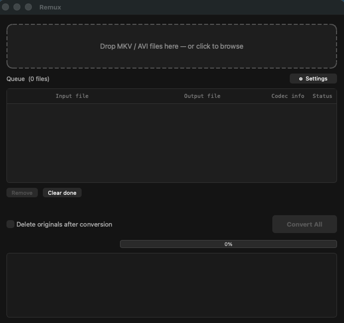

# Remux

A drag-and-drop desktop app for converting MKV and AVI files to Apple-compatible MP4.  
Built with Python and PyQt6. Works on macOS, Windows, and Linux.



---

## Features

- **Drag-and-drop** — drop one or multiple files onto the window to queue them
- **Batch queue** — convert multiple files in sequence with per-file status tracking
- **Smart codec handling**
  - Video is always stream-copied (no re-encoding, no quality loss)
  - HEVC files get the `hvc1` codec tag so QuickTime and Apple TV play them correctly
  - Audio is copied if it's already Apple-compatible (AAC, ALAC, MP3, AC3); otherwise re-encoded to AAC 256k
  - AVI subtitle tracks are dropped (they can't go into an MP4 container)
- **Editable output paths** — double-click the Output column to rename or redirect any file before converting
- **Codec info** — each queued file is probed in the background and shows its video/audio codecs, resolution, and duration
- **Settings** — set a default output folder so converted files always land in one place
- **Real-time progress** — live percentage bar per file, driven by ffmpeg's own progress stream
- **macOS notifications** — get a system notification when the full batch completes
- **Open output folder** — one click to reveal converted files in Finder after the batch is done
- **ffmpeg check on launch** — friendly error dialog with install instructions if ffmpeg isn't found

---

## Requirements

- Python 3.9+
- [ffmpeg](https://ffmpeg.org/) (includes ffprobe) — must be in your PATH

---

## Installation

### 1. Install ffmpeg

**macOS (Homebrew):**
```bash
brew install ffmpeg
```

**Windows (Chocolatey):**
```bash
choco install ffmpeg
```

**Linux (apt):**
```bash
sudo apt install ffmpeg
```

### 2. Install Python dependencies

```bash
pip install -r requirements.txt
```

### 3. Run

```bash
python remux_ui.py
```

---

## Usage

1. **Drop files** onto the drop zone, or click it to browse. MKV and AVI files are supported.
2. **Edit output filenames** by double-clicking the Output column in the queue. Type a bare filename to keep the same folder, or a full path to redirect.
3. **Set a default output folder** via ⚙ Settings if you always want files to land in one place.
4. **Check "Delete originals"** if you want the source files removed after a successful conversion.
5. Click **Convert All** and watch the progress bar. Each file's status updates in the queue.
6. When the batch finishes, click **📂 Open output folder** to jump straight to the results.

---

## Custom ffmpeg path

If ffmpeg is installed somewhere non-standard, set environment variables before launching:

```bash
FFMPEG_PATH=/path/to/ffmpeg FFPROBE_PATH=/path/to/ffprobe python remux_ui.py
```

---

## Why hvc1?

Apple devices require HEVC video in MP4 containers to be tagged as `hvc1` rather than the default `hvc1`/`hevc`. Without this tag, QuickTime opens the file but plays audio only with no video, and shows an "incompatible media" warning. Remux applies this tag automatically.

---

## Packaging as a standalone app (optional)

You can bundle Remux into a self-contained `.app` (macOS) or `.exe` (Windows) using PyInstaller:

```bash
pip install pyinstaller
pyinstaller --onefile --windowed --name Remux remux_ui.py
```

The output will be in the `dist/` folder.

---

## License

MIT — do whatever you like with it.
